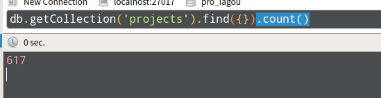

# spider_prolagou
爬取[大鲲](https://pro.lagou.com/project/)，基于Scrapy + MongoDB

# 运行
```
scrapy crwal quotes

# 输出JSON, CSV格式时在settings.py中注释掉自定义ITEM_PIPELINES
scrapy crwal quotes -o x.json
scrapy crwal quotes -o x.csv
```


# 成果
共爬到617条数据

MongoDB

CSV格式

